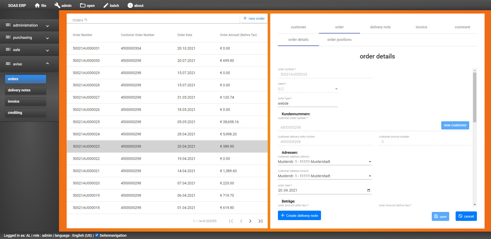

## custom-table-tab-group-view

###Contains a table view on the left and a tab-group view on the right. Used for example for orders component.

Link to component: [Link][custom-table-tab-group]

* Component description:

```
CustomTableTabGroupViewComponent - custom table tab-group view - contains the logic of the components that are using

- on left view: table view of CustomTableComponent
- on right view: tab-group with 5 tabs and as sub-tabs: form or table + form or p-table

CustomTableTabGroupViewComponent => { CustomTableComponent and DetailViewTabGroupComponent }

Used by: OrdersComponent, DeliveryNotesComponent, InvoicesComponent, CustbtwocComponent, CustbtwobComponent

Documentation at: /docs/create-new-component/table-tab-group/custom-table-tab-group-view.md
```
---

### 1. Create new custom-table-tab-group-view component:


Example [OrdersComponent][orders-component]:



* Component description:

```
 OrdersComponent: orders view component with a CustomTableTabGroupViewComponent:
 table (on left) and tab-group (on right)
 
 OrdersComponent => CustomTableTabGroupViewComponent => { CustomTableComponent and DetailViewTabGroupComponent }
 
 table:    [ORDERS] ( + ORDERS_POSITIONS)
 refTable: orders
```

---

### Important requirements before start:

* New table at TABLE_TEMPLATES is created
* New item at FORM_TEMPLATES is added
* New item at IMPORT_TEMPLATES (please extend docs for new import function: IMPORT_TYPE, IMPORT_TYPE_CONSTANTS, IMPORT_TYPE_REFERENCED_TABLES) is added
* Interface and class are added to server/client
* Servers constants.ts (DB_TABLE_COLUMNS) are updated

You find the documentation about that here: [Link][extend-database-two-tables]

---

### 1. Create component:

##### 1.1a Create in the Webstorm terminal via Angular command:

```
ng g component views/supply-orders --module=app
```

##### 1.1b Alternatively, you can manually create an "orders" folder under "views". Then create 4 files there:
* orders.component.ts: Component with logic
* orders.component.spec.ts: Test automation of the component
* orders.component.html: View of the component
* orders.component.css: Component styles

___

#### 1.2 Add html code to new component

##### 1.2.1 orders.component.html

The HTML code for the table, table and form is inserted here:

```
<app-custom-table-tab-group-view></app-custom-table-tab-group-view>
```

##### 1.2.2 orders.component.css

The custom CSS code for table and form can be inserted here.

```
.table-content {
    padding: 30px;
}
```

##### 1.2.3 orders.component.ts:

Add CustomTableTabGroupViewComponent component view:

* Before the constructor:
```
  // custom table + tab-group view component
  @ViewChild(CustomTableTabGroupViewComponent) customComponent !: CustomTableTabGroupViewComponent;
```

Add ngAfterViewInit() function:
```
ngAfterViewInit() -  Inside of ng after view init, call the initCustomTableFormView() function.
```

Add initCustomTableFormView() function after ngAfterViewInit() and add it to ngAfterViewInit:
```
initCustomTableFormView() - initialize the view, call CustomTableTabGroupViewComponent ng after view init function to 
load the table and tab-group data.
```

This function will be completed later. First you need to create constants for the new view in the next step 1.3.

#### 1.3 Extend constants service

Services-path: _services/constants.service.ts

##### 1.3.1 Add new constants

Add the constant names for the new table to the service class. These will be used later in the component.

Constants for referral table and the column name of the "main key":

```
  readonly REFTABLE_ORDERS: string = "orders";
  readonly REFTABLE_ORDERS_COLUMN: string = "ORDERS_NUMBER";
  readonly REFTABLE_ORDERS_TITLE: string = "ORDERS";
  readonly REFTABLE_ORDERS_DETAILS_TITLE: string = "ORDER_DETAILS";
  readonly REFTABLE_ORDERS_CUS_COLUMN: string = "CUSTOMER_ORDER";
  readonly REFTABLE_ORDERS_PAYMENT_TERM_ID: string = "PAYMENT_TERM_ID";
  readonly REFTABLE_ORDERS_POSITIONS = "orderPosition";
  readonly REFTABLE_ORDERS_POSITIONS_TITLE = "ORDER_POSITIONS";
  readonly REFTABLE_ORDERS_POSITIONS_COLUMN: string = "ORDERS_NUMBER";
  readonly REFTABLE_ORDERS_POSITIONS_ID: string = "ITMNUM";
  readonly REFTABLE_ORDERS_POSITIONS_ROW_ID: string = "ID";
  readonly REFTABLE_ORDERS_CUSTOMER_ORDERREF_COLUMN: string =
    "CUSTOMER_ORDERREF";
```

Constants for (table) item selection:

```
  readonly LS_SEL_ORDERS_NUMBER: string = "selOrdersNumber";
  readonly LS_SEL_ORDERS_PROV_ORDERS: string = "selOrdersProvOrders";
  readonly LS_SEL_ORDERS_POSITION_ID: string = "selOrdersPositionId";
  readonly LS_SEL_ORDERS_CUST_OR_PART_NUMBER: string = "selOrdersCOPNumber";
  readonly LS_SEL_ORDERS_CLIENT: string = "selOrdersClient";
```

#### 1.3.2 Add translations into LOCALIZE_IT table:

After adding the constants you need to add the translation for them into db LOCALIZE_IT table.

Example for countries view:

```
insert into [SOAS].[dbo].[LOCALIZE_IT] 
( [LOCALIZE_TAG],[DE_DE],[EN_US]) values ('COUNTRY', 'Land ', 'country');
...
insert into [SOAS].[dbo].[LOCALIZE_IT] 
( [LOCALIZE_TAG],[DE_DE],[EN_US]) values ('CREATE_NEW_COUNTRY', 'Neues Land', 'new country');
```


##### 1.3.3 Extend menu for new view

To display the view as a submenu, the constant "MENU_ITEMS" must be extended at _services / constants.service.ts.

The new view should appear in the menu under "Administration" ('ADMINISTRATION'):

Title 'ORDERS' (table name translation -> LOCALIZE_TAG) and
the "referral table" / refTable name 'countries' (TABLE_TEMPLATES -> REF_TABLE)
must be specified for the new entry.

Menu main items:

Optional: Add here new main item, if needed.

```
  readonly MENU_ITEMS = [
    {
      title: 'ADMINISTRATION',
      menuItems: [
        {
        ...

```

Required: Add new submenu item 'supplyOrders' to MENU_SUBITEMS > MASTER_DATA > menuItems.
The id should be unique.

```
readonly MENU_SUBITEMS = [
{
    title: 'MASTER_DATA',
    menuItems: [
        ...
        {
          id: "orders2",
          type: "button",
          title: "ORDERS",
          refTable: "orders",
        },
        ...
```

---

##### 1.4 Continue with orders.component.ts:

Setup the view initialization inside initCustomTableFormView() function:

* Set referral table name:
```
    // referral table name of the db table
    this.customComponent.setReferralTable(this.CONSTANTS.REFTABLE_ORDERS);
```

* Set table column names to query table or select item:
```
    // primary + secondary column names for item selection: e.g. selTableRow[primary column name = ORDERS_NUMBER]
    this.customComponent.setPrimaryTableColumnName(this.CONSTANTS.REFTABLE_ORDERS_COLUMN);
    this.customComponent.setSecondaryTableColumnName(this.CONSTANTS.REFTABLE_ORDERS_CUS_COLUMN);
    this.customComponent.setTertiaryTableColumnName(this.CONSTANTS.REFTABLE_ORDERS_CLIENT_COLUMN);
```

* Set values from local storage key to query table by or select item:
```
    // set local storage keys
    this.customComponent.setPrimaryLocalStorageKey(this.CONSTANTS.LS_SEL_ORDERS_NUMBER);
    this.customComponent.setSecondaryLocalStorageKey(this.CONSTANTS.LS_SEL_ORDERS_CUST_OR_PART_NUMBER);
    this.customComponent.setTertiaryLocalStorageKey(this.CONSTANTS.LS_SEL_ORDERS_CLIENT);
```

* Set main table view data settings (column name and local storage key):
```
this.customComponent.setPageParamsPrimaryColumnName(this.CONSTANTS.REFTABLE_COMPONENTS_PRIMARY_COLUMN);
// add local storage key as value
this.customComponent.setPageParamsPrimaryColumnValue(this.CONSTANTS.LS_SEL_COMPONENTS_ITEM_NUMBER);
```

* Set detail table view data settings (referral table and column names):
```
this.customComponent.setDetailViewRefTable(this.CONSTANTS.REFTABLE_SUPPLY_ORDERS_POSITIONS);
this.customComponent.setDetailViewPrimaryRefTableColumnName(this.CONSTANTS.REFTABLE_SUPPLY_ORDERS_POSITIONS_ROW_ID);
```

* Set selected item secondary id local storage key:
```
// local storage key to manage selection of detail view form item...
this.customComponent.setSelItemSecondaryIdLocalStorageKey(this.CONSTANTS.LS_SEL_SUPPLY_ORDERS_POSITION_ID);
```

* Set (detail) form loading data settings (column name and local storage key):
```
// form settings to load data by ID
this.customComponent.setDetailViewFormKey(this.CONSTANTS.REFTABLE_SUPPLY_ORDERS_PROV_COLUMN);
this.customComponent.setDetailViewFormValue(this.CONSTANTS.LS_SEL_SUPPLY_ORDERS_POSITION_ID);
```

* (Required) Set options (currency, states etc.) that should be loaded:

Example:
```
    // load only orders needed form options...
    this.customComponent.setFormOptionsToLoad([OptionsTypes.currencies, OptionsTypes.states, OptionsTypes.paymentTerms,
      OptionsTypes.warehouses, OptionsTypes.customerTypes]);
```

* Set titles for the view:
```
    // set titles
    this.customComponent.setTableTitle('ORDERS');
    this.customComponent.setCreateTitle('CREATE_NEW_ORDER');
    this.customComponent.setCreateTooltip('ADD_NEW_ORDER');
    
    this.customComponent.setDetailsFormTitle(this.CONSTANTS.REFTABLE_ORDERS_DETAILS_TITLE);
```

* Set table column names (to be displayed, for search and initial sort) for main table and detail view. Set table paginator:
```
    // set main table...
    // set displayed table column names
    this.customComponent.setDisplayedColumns(['ORDERS_NUMBER', 'CLIENT', 'ORDERS_TYPE', 'CUSTOMER_ORDER',
      'CUSTOMER_DELIVERY', 'ORDERS_DATE', 'ORDERAMOUNT_NET', 'ORDERAMOUNT_BRU', 'CURRENCY', 'PAYED,ORDERS_STATE',
      'RELEASE,WEBSHOP_ID', 'WEBSHOP_ORDER_REF', 'DISCOUNT', 'CUSTOMER_ADDRESSES_ID_DELIVERY',
      'CUSTOMER_ADDRESSES_ID_INVOICE']);
      
    this.customComponent.setSearchColumn(this.CONSTANTS.REFTABLE_ORDERS_COLUMN);
    this.customComponent.setAdditionalSearchColumns('CUSTOMER_ORDER,ORDERS_DATE,ORDERAMOUNT_BRU');
    this.customComponent.setInitialSort({property: 'ORDERS_NUMBER', order: 'desc'});
    this.customComponent.setColumnsToHide(['CLIENT', 'ORDERS_TYPE', 'CUSTOMER_DELIVERY', 'ORDERAMOUNT_NET', 'PAYED',
      'CURRENCY', 'WEBSHOP_ID', 'WEBSHOP_ORDER_REF', 'DISCOUNT', 'CUSTOMER_ADDRESSES_ID_DELIVERY',
      'CUSTOMER_ADDRESSES_ID_INVOICE', 'CURRENCY', 'PAYED,ORDERS_STATE', 'RELEASE,WEBSHOP_ID']);
```

* Set empty item data for new item mode:
```
    // set empty table model for the new item mode
    this.customComponent.setEmptyModel(new Orders('', this.CONSTANTS.CLIENT_B2C,
      this.CONSTANTS.ORDER_TYPES[0], '', '', '','', '', '',0, 0,
      this.CONSTANTS.CURRENCY_EU, '', '', '', '',
      false, false,false, this.CONSTANTS.ORDER_STATES_OPEN, 0,'', 0,0, 0, ''));
```

* Start to load data by activate flag and call ng after view init:
```
    // allow to load view after all parameters are set
    this.customComponent.startLoading = true;
    this.customComponent.ngAfterViewInit();
```

___

#### 1.5 Extend routes

Finally, you have to register the new component with the routes so that the route can be resolved.

Browser-Link: http://localhost:3000/#/orders

* app-routing-module.ts

Here you enter the "referral table" name "orders" and the associated component.

```
const routes: Routes = [
    ...

     {
    path: "orders",
    component: OrdersComponent,
    canActivate: [AuthGuard],
  },

```
___

#### 1.6 Additional steps for custom table-tab-group component:

##### 1.6.1 [CustomTableTabGroupViewComponent][custom-table-tab-group] contains some of if-conditions, switch cases that checks for referral tables, e.g. REFTABLE_ORDERS etc..
So add for a new component the referral name to the conditions, if necessary. 
Some examples:
* createNewItem() function contains a switch, to preselect first tab of specific component at new item mode.
* loadNewFormData() function contains if conditions. If new component have a new item mode, add new condition there.
* emptyForms() function has a condition for orders only, to remove tertiary local storage key.

#### 1.6.2 [DetailViewTabGroupComponent][detail-view-tab-group-component] view and his services contains if-conditions that need to be extended:
* getParamDataForLoading() in [detail-view-tab-group-load.service][detail-view-tab-group-load]

If you add new main tab (currently 5), you need to extend following 3 functions in [detail-view-tab-group-tabs.service][detail-view-tab-group-tabs]:
* getSelectedSubTabGroupIndex()
* getTabAndTabGroup()
* selectTab()

---

#### At problems:

If there are problems with the view setup, check the steps of the another view type.
For example the [custom-table-form-view][custom-table-form-view] or [custom-table-form-view][custom-table-table-form-view] or the main soas.md file documentation.
at [\docs\soas.md][soas].


---

[soas]: ../..\soas.md
[custom-table-tab-group]: ../../..\client\src\app\views\custom\custom-views\custom-table-tab-group-view\custom-table-tab-group-view.component.ts
[orders-component]: ../../..\client\src\app\views\orders\orders.component.ts
[custom-table-form-view]: ..\custom-table-form-view\custom-table-form-views.md
[custom-table-table-form-view]: ..\custom-table-table-form-view\custom-table-table-form-view.md
[extend-database-two-tables]: ..\extend-database-two-tables.md
[detail-view-tab-group-component]: ../../..\client\src\app\views\detail-view-tab-group\detail-view-tab-group.component.ts
[detail-view-tab-group-tabs]: ../../..\client\src\app\views\detail-view-tab-group\detail-view-tab-group-tabs.service.ts
[detail-view-tab-group-load]: ../../..\client\src\app\views\detail-view-tab-group\detail-view-tab-group-load.service.ts

