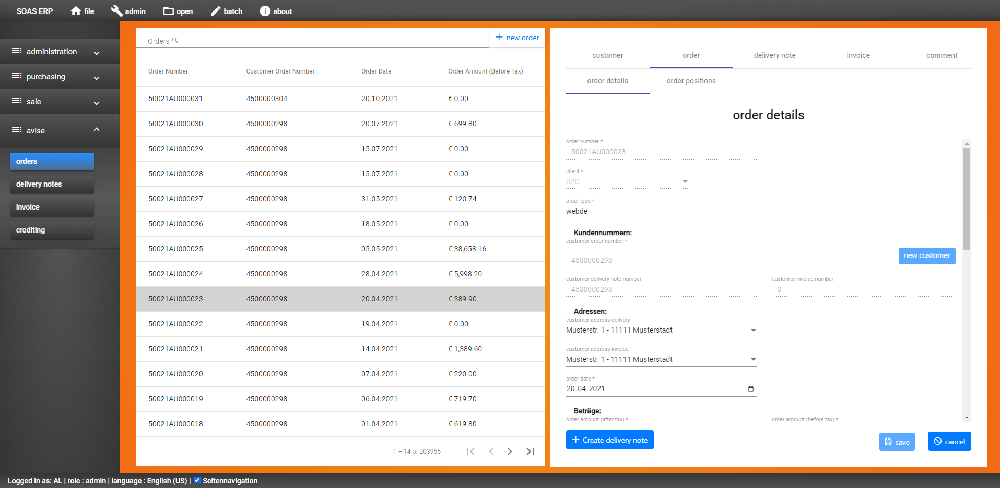

## Orders

Link to orders component: [Link][component]




* Component description:

```
 OrdersComponent: orders view component with a CustomTableTabGroupViewComponent:
 table (on left) and tab-group (on right)
 
 OrdersComponent => CustomTableTabGroupViewComponent => { CustomTableComponent and DetailViewTabGroupComponent }
 
 table:    [ORDERS] ( + ORDERS_POSITIONS)
 refTable: orders
```

Orders component is based on [custom-table-tab-group-view][custom-table-tab-group-view]. See custom-table-tab-group-view.md for how to set up the orders view component.

#### Important 2 documentations for creating new component:

* Custom-table-tab-group-view documentation: [Link][custom-table-tab-group-view]

* Database and server documentation: [Link][extend-database-two-tables].

Link to main SOAS documentation: [Link to soas.md][soas]

[soas]: ../..\soas.md
[component]: ../../..\client\src\app\views\orders\orders.component.ts
[custom-table-tab-group-view]: \custom-table-tab-group-view.md
[extend-database-two-tables]: ..\extend-database-two-tables.md
