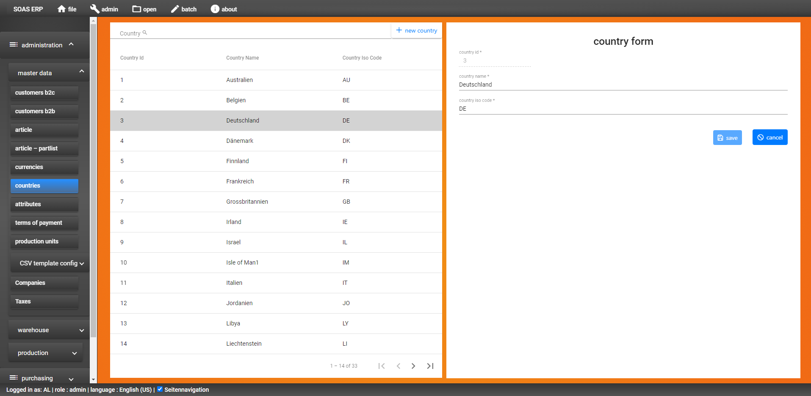

# SOAS ERP

## Documentation

Last change: 02.11.2021

___

Contents:

1. [Create a new view](#anchorone)
2. [Formly form](#anchorformly)
3. [CSV import dialog](#anchortwo)
4. [Batch dialog](#anchorthree)
5. [Run second instance of SOAS](#anchorfour)
6. [Add a new item to admin menu](#anchorfive)
7. [Compile and run client/server](#anchorsix)
8. [Debug client](#anchorseven)
9. [Unit testing](#anchoreight)
10. [Allocate order position](#a-idanchore10--10-order-allocate-positions)
11. [Create delivery note](#a-ifanchore11--11-create-delivery-note)
12. [Create invoice](#a-ifanchore12--12-create-invoice)

---
List of components and their view types:

| Component           | Custom  | View type  |
|:------------------- |:-------------:|:-------------:|
| [ArticlesComponent][articles-view]        | No | CustomTableComponent + CustomFormComponent and AttributePDialogComponent   | 
| [PriceListSalesComponent][price-list-sales-view]      | No  | CustomTableComponent + CustomPTableComponent  | 
| CountriesComponent, CurrenciesComponent, PaymentTermsComponent, ProductUnitsComponent, ProvidersComponent, CompaniesComponent, ImportTypesComponent, ImportTypesRefTablesComponent, ImportTypeConstantsComponent | Yes | CustomTableFormViewComponent  | 
| ArticleComponentsComponent, WarehousingComponent, TaxesComponent, ProductComponents, AttributesComponent, ArticleComponents, SupplyOrdersComponent       | Yes | CustomTableTableFormViewComponent  | 
| OrdersComponent, DeliveryNotesComponent, InvoicesComponent, CustbtwocComponent, CustbtwobComponent        | Yes | CustomTableTabGroupViewComponent  | 

---

### <a id="anchorone" /> 1. Create a new view:

There is 3 view types possible:

1) custom-table-form-view - Based on CustomTableFormViewComponent. Contains a table view on the left and a form view on the right. 

Used for example for countries component.



* Component description:
```
    CustomTableFormViewComponent - custom table form view, contains the logic of the components that are using

   - on left view: table view of CustomTableComponent
   - on right view: form view of CustomFormComponent
    
    Used by: Countries, Currencies, PaymentTerms, ProductUnits, Providers, Companies, ImportTypes,
    ImportTypesRefTablesComponent, ImportTypeConstants

   Documentation for this view starts in this md-file at topic ### 1.1
```
[Link to documentation of the CustomTableFormViewComponent view][custom-table-form-view].

```
    If link don't opens, you find the documentation for this view at \docs\create-new-component\table-form\custom-table-form-view.md
```

---

2) custom-table-table-form-view - Contains a table view on the left and a table + form view on the right. Used for example for components (DIST_COMPONENTS) component.

* Component description:
```
    CustomTableTableFormViewComponent - custom table table form view - contains the logic of the components that are using

    - on left view: table view of CustomTableComponent
    - on right view: table and form views of DetailViewListComponent

    Used by: Warehousing, Taxes, ProductComponents, Attributes, ArticleComponents
```

[Link to documentation of the CustomTableTableFormViewComponent view][custom-table-table-form-view].

```
Documentation path: \docs\create-new-component\table-table-form\custom-table-table-form-view.md
```

---

3) custom-table-tab-group-view - Contains a table view on the left and a tab-group view on the right. Used for example for orders component.

* Component description:
```
    CustomTableTabGroupViewComponent - custom table tab-group view - contains the logic of the components that are using

   - on left view: table view of CustomTableComponent
   - on right view: tab-group with 5 tabs and as sub-tabs: form or table + form or p-table

    Used by: OrdersComponent, DeliveryNotesComponent, InvoicesComponent, CustbtwocComponent, CustbtwobComponent
```

[Link to documentation of the CustomTableTabGroupViewComponent view][custom-table-tab-group-view].

```
   If link don't opens, you find the documentation for this view at \docs\create-new-component\custom-table-tab-group-view.md
```
___

### <a id="anchorformly" /> 2. Formly form

Documentation about formly form you can find at topic 1.3 of [/create-new-component/extend-database-one-table][extend-database-one-table] file.

---

###  <a id="anchortwo" /> 3. Csv import dialog:</a>

The csv import dialog can be opened via the "Open > CSV import" menu.

The documentation for this can be found under [docs>csv-import.md][csv-import].

---

### <a id="anchorthree" /> 4. Batch dialog:

The batch dialog can be opened via the "Batch> Batch server" menu.

The documentation for this can be found under [docs>batch.md][batch-view].

---

### <a id="anchorfour" /> 5. Run second instance of SOAS:

It can be helpful t run second instance of SOAS, for example for running script for import data from Sage.

So change port from 3000 to 4000 for example.

Change it on 3 places:

##### 5.1 SAOS > bin > www

```
var port = normalizePort(process.env.PORT || '4000');
```

##### 5.2 SOAS > client > src > app > _services > constants.service.ts 

Link to constants.service.ts: [Link to constants][app-services]

```
  readonly SERVER_URL: string = 'http://localhost:4000';
```

##### 5.3 SOAS > client > src > app > app.module.ts

Link to app.module.ts: [Link to app.module][app-module]

```
JwtModule.forRoot({
      config: {
        tokenGetter: tokenGetter,
        whitelistedDomains: ['localhost:4000'],
        blacklistedRoutes: ['localhost:4000/api/auth']
      }
    }),
```

---

### <a id="anchorfive" /> 6. Add a new menu item to admin menu:

##### 6.1 Client: Go to constants.service.ts and there to NAV_ITEMS. Add to 'displayName: "ADMIN",' section a new child:

```
        {
          displayName: "EMPTY_LOCAL_STORAGE",
          iconName: "remove_circle",
          route: "empty-local-storage",
          id: "admin16",
          click: "",
        },
```

Icon name can be found at: [google-font-icons-link page][google-font-icons-link]

##### 6.2 DB: Add translation for new menu item:

```
insert into [SOAS].[dbo].[LOCALIZE_IT] ( [LOCALIZE_TAG]
,[DE_DE]
,[EN_US]) values ('EMPTY_LOCAL_STORAGE',
'LocalStorage leeren.',
'Empty LocalStorage.');
```

##### 6.3 Create new component:

```
C:\Repos\Soas\client\src\app\dialogs> ng g component LocalStorageDialog --module=app
```

Add logic to the new component. E.g. add method with logic to the ngOnInit().

```
ngOnInit(): void {
    this.emptyLocalStorage();
}
```

##### 6.4 Set the route for the new component to the app-routing.module.ts:

Link to app-routing.module: [app-routing.module.ts][app-routing-module]

```
{
path: "empty-local-storage",
component: LocalStorageDialogComponent,
canActivate: [AuthGuard],
},
```  

---

### <a id="anchorsix" /> 7. Compile and run client/server

See [angular.md][angular] file for it.

---

### <a id="anchorseven" /> 8. Debug client

See [angular.md][angular] file for it.

---

### <a id="anchoreight" /> 9. Unit testing

For client see [unit-test-client][unit-test-client] file for it.

For server see [unit-test-server][unit-test-server] file.

---

### <a id="anchore10" /> 10. Order position(s) (allocate, delete)

Allocate: 

DetailViewTabGroupComponent > [onTableFormAllocate][allocate-position]

Delete position:

CustomPTableComponent > [deletePosition][custom-p-table-component]

---

### <a id="anchore11" /> 11. Delivery note (create, delete)

Create delivery note:

DetailViewTabGroupComponent > [createDeliveryNote][create-delivery-note]

Delete delivery note:

DetailViewTabGroupComponent > [deleteDeliveryNote][create-delivery-note]

---

### <a id="anchore12" /> 12. Create invoice

DetailViewTabGroupComponent > [createInvoice][create-invoice]

---

[soas-start]: http://localhost:3000
[articles-view]: ..\client\src\app\views\articles\articles.component.ts
[price-list-sales-view]: ..\client\src\app\views\price-list-sales\price-list-sales.component.ts
[custom-table-form-view]: \create-new-component\table-form\custom-table-form-view.md
[custom-table-table-form-view]: \create-new-component\table-table-form\custom-table-table-form-view.md
[custom-table-tab-group-view]: \create-new-component\table-tab-group\custom-table-tab-group-view.md
[batch-view]: \batch.md
[csv-import]: \csv-import.md
[app-routing-module]: ..\client\src\app\app-routing.module.ts
[app-module]: ..\client\src\app\app.module.ts
[app-services]: ..\client\src\app\\_services\constants.service.ts
[google-font-icons-link]: https://fonts.google.com/icons?selected=Material+Icons+Outlined:table_chart&icon.query=delete
[angular]: \angular.md
[unit-test-client]: .\test\unit-test-client.md
[unit-test-server]: .\test\unit-test-server.md
[extend-database-one-table]: \create-new-component\extend-database-one-table.md
[create-delivery-note]: ..\client\src\app\views\detail-view-tab-group\detail-view-tab-group.component.ts
[create-invoice]: ..\client\src\app\views\detail-view-tab-group\detail-view-tab-group.component.ts
[allocate-position]: ..\client\src\app\views\detail-view-tab-group\detail-view-tab-group.component.ts?onTableFormAllocate
[custom-p-table-component]: ..\client\src\app\views\custom\custom-p-table\custom-p-table.component.ts
